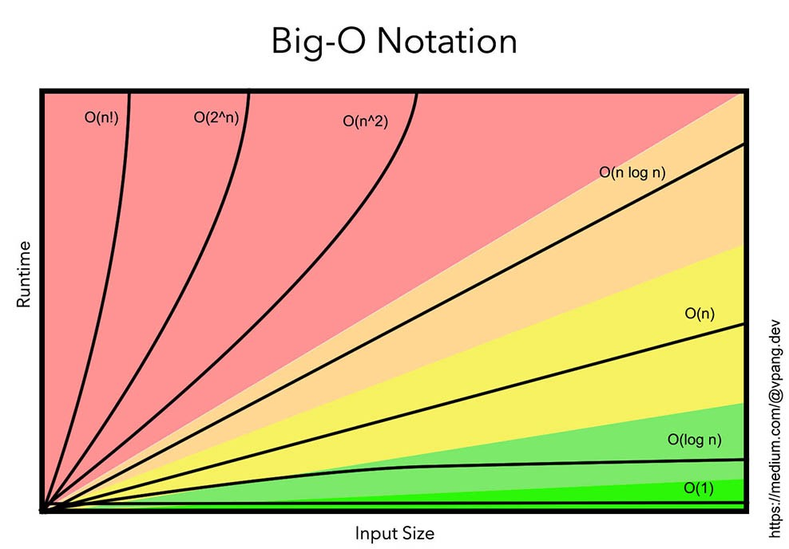

# Python Data Structures and Algorithms Toolkit

This repo is a toolkit and personal reference for data structure and algorithms in Python3.

- Libraries are summarized into an accessible subset of the official docs as a usable reference for 90%+ of data structure and algorithm questions.

- Data structure implementations are added.

- Patterns for common problem types are in progress.

- Links and resources are available.

## Python Critical Libraries
### 'collections' library: specialized containers

- deque
- Counter
- defaultdict
- OrderedDict
- namedTuple

### 'functools' library: higher-order functions and decorators

- lru_cache

### 'heapq' library: min and max priority queue implementation

- heappush
- heappop
- heapify
- heapsort
- merge
- nlargest
- nsmallest

### 'itertools' library: iterator and combinatorics tools

##### Iterator

- accumulate
- chain
- chain.from_iterable
- pairwise
- starmap

##### Combinatorics

- product
- permutations
- combinations
- combinations_with_replacement

### 'math' library: frequently used math helper methods

- ceil
- comb
- floor
- perm
- inf

### 'regex' library: python regular expression matching

- compile
- search
- match
- fullmatch
- split
- findall
- sub
- escape

### 'string' library: string helper methods

- ascii_letters
- ascii_lowercase
- ascii_uppercase
- digits

## Python Data Structures:

- deque
- doubly linked-list
- linked-list
- queue
- stack
- tree

## DSA Patterns:

- backtracking
- bitwise manipulation
- cyclic sort
- dynamic programming
- fast and slow pointers
- greedy algorithms
- hash maps
- in-place reversal of a linked list
- k-way merge
- lru-cache
- merge intervals
- modified binary search
- sliding window
- stacks
- subsets
- top-k-elements
- topological sort
- tree breath first search
- tree depth first search
- tries
- two heaps
- two pointers
- union find

## Resources:
